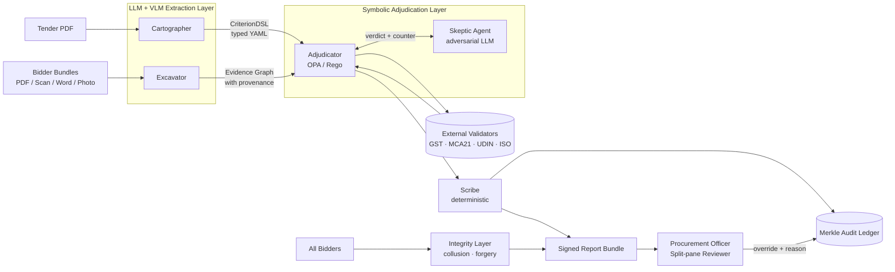
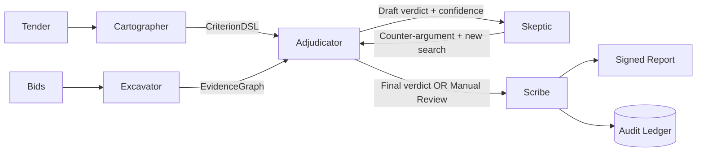
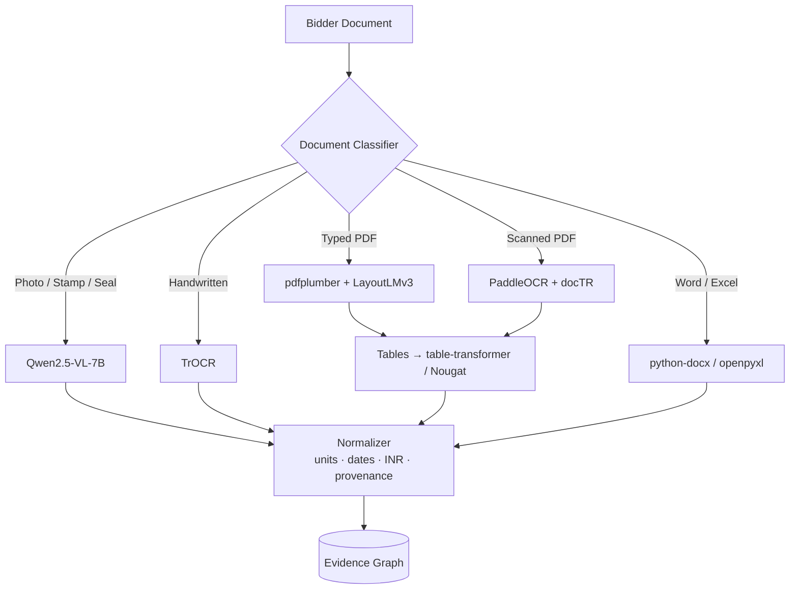

# PRAMAAN — Master Solution Document

**Theme 3 · CRPF · AI-Based Tender Evaluation and Eligibility Analysis**

---

## 1. Executive summary

The Central Reserve Police Force evaluates tenders that arrive as 200–800 page documents and bidder responses that arrive as messy bundles of typed PDFs, scanned PDFs, Word files, Excel sheets, and photographs of physical certificates. Today this is a manual, slow, inconsistent, and audit-poor process. Two evaluators reading the same set of documents can reach different conclusions, and there is no machine-readable trail of *why* a bidder was rejected.

We propose **PRAMAAN** — a sovereign, neuro-symbolic, cryptographically-auditable platform that:

- extracts the eligibility criteria from a tender into a typed, machine-readable form (the **Criterion DSL**),
- ingests every bidder bundle through a multi-modal pipeline (OCR + VLM + layout) and builds a **pixel-grounded Evidence Graph**,
- adjudicates each bidder against each criterion using **Open Policy Agent (Rego)** — a deterministic rules engine, not an LLM,
- routes every ambiguous, low-confidence, or contested case to a **Manual Review** queue with a human-readable reason,
- emits a **signed report bundle** and writes every decision to a **Merkle-chained audit ledger** so that the evaluation can be replayed bit-for-bit and admitted as part of a formal procurement record.

We never let a language model utter the words "Eligible" or "Not Eligible." LLMs and vision models propose; symbolic logic disposes; cryptography preserves.

---

## 2. Problem reframed in CRPF reality

The brief is well-written but understandably surface-level. Building for a paramilitary procurement context surfaces realities most teams will miss:

- **Sovereignty is not negotiable.** A working solution that calls OpenAI or Anthropic over the public internet will be rejected by the procurement officer's IT security clearance. The system must run on-prem and air-gapped, on **open-weights** models.
- **The verdict is a legal artifact.** A rejection becomes the basis for a bidder's appeal under the CVC guidelines and the GFR (General Financial Rules). The system must produce a record that survives scrutiny by an external auditor, the CVC, and potentially a court.
- **Bidders are not always honest.** ISO certificates are forged, GST registrations lapse, "experience certificates" are fabricated, and three "different" companies with the same director and address bid in collusion. A system that only does eligibility is doing half the job.
- **The legal language is adversarial.** Tenders use "shall," "may," "should," "preferably," "desirable," and "essential" with very specific procurement-law meanings. Conflating them creates appeals.
- **Data lives in registries.** GSTIN status, CIN status (MCA21), CA-attestation UDIN (ICAI), MSME/NSIC registration, ISO accreditation body lookups — all of these are real APIs the system can hit to verify, not just trust the bidder's PDF.
- **The officer is not a developer.** The UI must read like a procurement file, not a Jupyter notebook.

PRAMAAN is built around all five of these realities, not just the brief's sample scenario.

---

## 3. Solution at a glance



Five extraction → adjudication → audit → review stages. Every arrow carries provenance. Nothing is implicit.

---

## 4. The five woven pillars

These are the differentiators. Each is a section of its own elsewhere; here is the spine.

### Pillar 1 — Sovereign by default

PRAMAAN ships in two profiles.

- **Sovereign profile (production).** Air-gapped K8s. Open-weights only: Qwen2.5-VL-7B for vision, Llama-3.1-70B-Instruct or Qwen2.5-72B for extraction, served via vLLM with tensor parallelism. PaddleOCR for printed text (best Indic-script support), TrOCR for handwriting. All model weights hash-pinned in a local artifact registry; no silent upgrades.
- **Pilot profile (benchmarking).** Optionally permits hosted APIs (OpenAI / Anthropic / Gemini) for side-by-side benchmarking against the open-weights baseline. Hard-gated by a feature flag and never enabled in production.

This single design choice eliminates the largest objection a CRPF IT security cell will raise.

### Pillar 2 — Neuro-symbolic adjudication ("LLMs propose, rules dispose")

The heart of the system. The data flow is:

1. The **Cartographer** agent (an LLM with strict structured output) reads the tender and emits a typed `CriterionDSL` document — every criterion is a typed constraint with a `mandatory` flag, an evidence requirement, and an optional list of external validators.
2. The **Excavator** agent (LLM + OCR + VLM) reads the bidder bundle and emits an `EvidenceGraph` — typed values, each with full provenance.
3. The **Adjudicator** is **Open Policy Agent** evaluating Rego policies generated from the CriterionDSL. The verdict is the output of pure, declarative logic. **No LLM is in the verdict path.**

Why this matters: hallucinations cannot produce a wrong "Eligible." If the LLM extracts the wrong number, the verdict will reflect that wrong number — but the wrong number is right there in the report, traceable to the bbox it came from, easily caught by the officer or the Skeptic. The system fails *visibly*, not silently.

### Pillar 3 — Pixel-grounded Evidence Graph

Every value in the system has full provenance:

```json
{
  "field": "annual_turnover_inr",
  "value": 75000000,
  "fy": "2023-24",
  "source": {
    "doc_id": "bidder_07/audited_fs_2023_24.pdf",
    "doc_sha256": "9f2b…",
    "page": 14,
    "bbox": [121, 488, 312, 511],
    "ocr_conf": 0.987,
    "extractor_conf": 0.94,
    "extractor_model": "qwen2.5-72b@vllm",
    "extractor_prompt_hash": "p:v3-2026-04-19"
  }
}
```

In the Officer UX, every cell of the report is a click-target. Clicking jumps the right pane to the source PDF, page 14, with the bbox highlighted. This is the difference between "AI says so" and "the audited financial statement on page 14, lines 488–511, says so."

### Pillar 4 — Multi-agent adversarial verification

Five agents with narrow contracts and no shared mutable state.



The **Skeptic** is an LLM whose only job is to argue against the Adjudicator's draft verdict. If it produces a non-trivial counter-argument grounded in the Evidence Graph, the verdict is downgraded to **Manual Review**. This is the "two evaluators on the same documents" problem solved in code: we *demand* disagreement, then escalate when it appears.

### Pillar 5 — Cryptographic audit ledger

Every event is appended to a hash-chained log:

```
event_n.prev_hash = sha256(event_{n-1})
event_n.hash      = sha256(event_n.payload || event_n.prev_hash)
```

Optional backing by [`immudb`](https://github.com/codenotary/immudb) for tamper-evident storage. Every final report is a **signed bundle**:

```
ReportBundle = sign_HSM(
  tender_sha256,
  bidder_sha256_list,
  criterion_dsl,
  evidence_graph,
  verdicts,
  model_versions,
  prompt_versions,
  rule_versions,
  ts
)
```

**Reproducibility property**: re-running the system on the same inputs with the same artifact pins must produce a byte-identical bundle. Where models are non-deterministic, we seed and pin temperature=0; where retrieval is involved, we pin the corpus snapshot. The result is an evaluation that can be re-run by an auditor, the CVC, or a court — and must agree with the original.

---

## 5. The Criterion DSL (the contract that holds it all together)

Worked example for the brief's sample tender — *minimum turnover ₹5 cr; ≥3 similar projects in 5 yrs; valid GST; ISO 9001*.

```yaml
tender:
  id: T-CRPF-2026-CONST-014
  source_sha256: e3a1…
  classification: construction_services

criteria:
  - id: C1
    type: financial
    mandatory: true
    text: "Minimum annual turnover of Rs. 5 crore"
    constraint:
      field: annual_turnover_inr
      op: ">="
      value: 50_000_000
      window: { last_n_fy: 3, aggregator: any }
    evidence_required:
      - audited_financial_statement
      - ca_certificate
    validators: [icai_udin_lookup]

  - id: C2
    type: technical
    mandatory: true
    text: "At least 3 similar projects completed in the last 5 years"
    constraint:
      field: completed_projects
      filter:
        similarity_to_tender_scope: ">= 0.75"
        status: completed
        completion_date: ">= today - 5y"
      op: "count >="
      value: 3
    evidence_required: [completion_certificate, work_order]

  - id: C3
    type: compliance
    mandatory: true
    text: "Valid GST registration"
    constraint:
      field: gstin
      op: "regex_match + active_on(today)"
    validators: [gstn_api_lookup]

  - id: C4
    type: certification
    mandatory: true
    text: "ISO 9001 certification"
    constraint:
      field: iso_9001
      op: "exists + valid_on(today)"
    validators: [iso_accreditation_body_lookup]
```

This is what the LLM is **allowed** to produce. This is what Rego consumes. Verdicts emerge from Rego. Full DSL spec in [`03-criterion-dsl.md`](03-criterion-dsl.md).

---

## 6. Document understanding pipeline

The bidder pile is a zoo: typed PDFs, scanned PDFs at 200 DPI, photographs of certificates taken at angles, Word files with embedded images, Excel sheets with merged cells, and the occasional handwritten endorsement on a stamped page. We classify and route:



Every span emerges with `(doc_hash, page, bbox, ocr_conf, extractor_conf, model_version)`. Low-confidence spans are not discarded — they are retained, flagged, and routed to the abstention policy. Full pipeline in [`04-document-pipeline.md`](04-document-pipeline.md).

---

## 7. Adjudication and the abstention policy

The Adjudicator is OPA. The Rego policy for `C1` (turnover) compiled from the DSL above is roughly:

```rego
package eligibility.C1

default verdict := "manual_review"

evidence := input.evidence.financial.annual_turnover_inr_by_fy
ca_cert  := input.evidence.documents.ca_certificate

threshold := 50000000
window_fys := [fy | fy := evidence[_].fy; date.diff_years(fy, time.now()) <= 3]

passing_fys := [fy |
  e := evidence[_]
  e.fy == window_fys[_]
  e.value >= threshold
  e.confidence >= 0.85
]

verdict := "eligible" {
  count(passing_fys) >= 1
  ca_cert.exists
  ca_cert.udin_verified
}

verdict := "not_eligible" {
  count(passing_fys) == 0
  count(window_fys) >= 1
  all_high_confidence(window_fys)
}
```

A bidder lands in **Manual Review** (never silent disqualification) when **any** of these fire:

- OCR confidence on the supporting evidence < threshold T1 (default 0.80)
- Cross-document agreement score < T2 (e.g. turnover differs across audited FS and CA certificate)
- The Skeptic agent produces a non-trivial, evidence-grounded counter-argument
- Any external validator returns `inconclusive` (e.g. GST API timeout)
- Criterion's `mandatory` flag was assigned with low confidence (e.g. tender says "preferably ISO 9001")

Each escalation carries a human-readable reason. Full policy + abstention design in [`05-adjudication.md`](05-adjudication.md).

---

## 8. Audit and reproducibility

The brief calls auditability a non-negotiable. PRAMAAN treats it as the system's spine, not a logging afterthought.

- **Hash-chained event log.** Every extraction, rule evaluation, validator call, verdict, and officer override appends an event whose hash includes the previous event's hash. Tampering is detectable.
- **Signed report bundle.** Final report is signed by an HSM key (SoftHSM in dev, YubiHSM/CloudHSM in prod). Includes hashes of all inputs and pins of every model/prompt/rule version used.
- **Reproducibility.** Re-running the same inputs with the same pins must produce a byte-identical bundle. We test this in CI with golden bundles.
- **Officer overrides.** When an officer overrides a verdict, the override is itself an event in the chain — including the officer's identity (OIDC), the reason (free text + structured tag), and the timestamp. The original verdict is never deleted.

Full design in [`06-audit-ledger.md`](06-audit-ledger.md).

---

## 9. The procurement officer experience

A procurement officer should never have to read a JSON file. The UX is a single split-pane application:

- **Left pane.** The Evaluation Report — bidders × criteria as a grid, color-coded *Eligible / Not Eligible / Manual Review*. Each cell shows the value, the source document, and the confidence. Each cell is clickable.
- **Right pane.** A PDF viewer. Clicking a cell opens the source document, jumps to the right page, draws the bbox highlight, and shows the Skeptic's counter-argument if any.
- **Override workflow.** The officer can change any verdict. They must enter a reason (free text + a tag from a controlled vocabulary). The override goes straight into the audit chain.
- **Sign-off.** When the officer is satisfied, they sign the report. The signature is appended to the bundle. The bundle is exported as a single PDF + a `.pramaan` archive (signed JSON + all evidence excerpts).

Mock screen layouts in [`07-officer-ux.md`](07-officer-ux.md).

---

## 10. The bonus integrity layer

Most submissions will stop at "did this bidder meet the criteria?" PRAMAAN goes one step further: **did this bidder behave honestly?** A separate analytics pass over the *set* of bidders looks for:

- **Cartel signals** — shared phone numbers, addresses, directors (CIN cross-reference), bank accounts, IPs, near-duplicate document hashes, suspiciously similar bid prices ("rotation bidding")
- **Forgery signals** — font inconsistency in scanned certificates, EXIF/metadata anomalies, ISO certificate numbers absent from accreditation body registries, GST status mismatch with the date of issue claimed
- **Capacity signals** — bidder claiming three concurrent ₹50 cr projects with eight employees on EPFO

These do not auto-disqualify. They appear as an **Integrity Panel** on the report, with reasoning. The officer decides. Full layer in [`08-integrity-layer.md`](08-integrity-layer.md).

---

## 11. Architecture and stack at a glance

| Layer | Choice | Why |
|---|---|---|
| Backend | Python 3.12 + FastAPI | ML/OCR ecosystem fit; async-friendly |
| Frontend | Next.js 15 + TypeScript + shadcn/ui + react-pdf | Modern, accessible, easy bbox-overlay |
| OCR (printed) | PaddleOCR | Best Indic-script support; GPU-accelerated |
| OCR (handwritten) | TrOCR | SOTA for handwritten English |
| Vision-language | Qwen2.5-VL-7B (Apache-2.0) | Self-hostable; strong on stamps, seals, photos |
| Layout / tables | LayoutLMv3 + table-transformer + Nougat | Best-of-breed for each layout class |
| LLM extractor | Llama-3.1-70B-Instruct or Qwen2.5-72B via vLLM | Open-weights; sovereign-deployable; structured-output capable |
| Structured output | Outlines / Instructor | Guaranteed schema conformance |
| Rules engine | Open Policy Agent (Rego) | Declarative, auditable, battle-tested in govt/enterprise |
| Vector store | Qdrant | Self-hostable; metadata filtering |
| Primary store | Postgres 16 + JSONB + pgvector | One DB, three workloads |
| Audit ledger | Postgres append-only + Merkle chain; optional `immudb` | Tamper-evident |
| Orchestration | Custom finite-state-machine agent runtime | LangGraph is too opaque for an audit context |
| LLM observability | Langfuse (self-hosted) | Per-call tracing, prompt versioning |
| Auth | OIDC, designed for NIC SSO / e-Pramaan | Govt-friendly |
| Deploy | Docker Compose (sandbox) → Helm air-gap chart (prod) | Reproducible, offline-installable |

Full justification of every choice (and what we rejected and why) in [`09-stack-rationale.md`](09-stack-rationale.md).

---

## 12. Risks and trade-offs

We are honest about what can go wrong. Top five (full table in [`10-risks-tradeoffs.md`](10-risks-tradeoffs.md)):

| Risk | Mitigation |
|---|---|
| LLM hallucinates a criterion | Skeptic agent + officer-reviews CriterionDSL **before** adjudication runs |
| OCR garbles a key number on a faded scan | Confidence threshold → Manual Review with the bbox shown to the officer |
| Forged ISO/GST certificate | External registry validators + Integrity Layer signals |
| Adversarial prompt injection inside a tender PDF | All extracted text is treated strictly as data; system prompts hash-pinned; sandboxed parsing |
| Self-hosted 70B model latency / cost | AWQ/GPTQ quantization; batched inference; criterion-level result caching keyed on `(criterion_hash, evidence_hash)` |

---

## 13. Round 2 implementation plan

Six-week build, week-by-week, in [`11-round2-roadmap.md`](11-round2-roadmap.md). High-level:

- **W1**: Repo + ingestion + OCR/VLM/layout pipeline + provenance tagging
- **W2**: Cartographer agent + CriterionDSL schema + tender ingestion of 1 sample
- **W3**: Excavator agent + Evidence Graph + Postgres schema
- **W4**: Adjudicator (OPA Rego) + Skeptic agent + abstention policy
- **W5**: Officer UX (split-pane PDF + report, override workflow)
- **W6**: Audit ledger + signed report export + Integrity Layer + demo polish

---

## 14. What "good" looks like for the demo

By the end of Round 2 we will demo, end-to-end, the brief's sample scenario:

1. Officer uploads `tender_construction_2026.pdf` and ten bidder folders, mixing typed PDFs, scans, and a few photographed certificates.
2. The system extracts the four criteria, displays them, and asks the officer to confirm/edit (mandatory vs optional).
3. For each bidder, the system produces a row in the report: 6 green, 3 red, 1 amber.
4. The officer clicks the amber bidder's turnover cell. Right pane jumps to the scanned audited FS, page 14, with the bbox highlighted. The reason "OCR confidence 0.62 on the figure ₹5,12,00,000 — re-photograph or upload a clearer scan recommended" appears next to it.
5. Officer uploads a clearer scan; the system re-evaluates that single criterion in seconds; the bidder turns green.
6. Officer clicks **Sign and Export**. A signed PDF + `.pramaan` archive is downloaded. The audit ledger shows every event in order.

That is the bar.

---

## 15. Reading order from here

If you want depth, continue with [`02-architecture.md`](02-architecture.md). If you want to understand the central abstraction, skip to [`03-criterion-dsl.md`](03-criterion-dsl.md). If you are evaluating defensibility, jump to [`06-audit-ledger.md`](06-audit-ledger.md) and [`08-integrity-layer.md`](08-integrity-layer.md).
