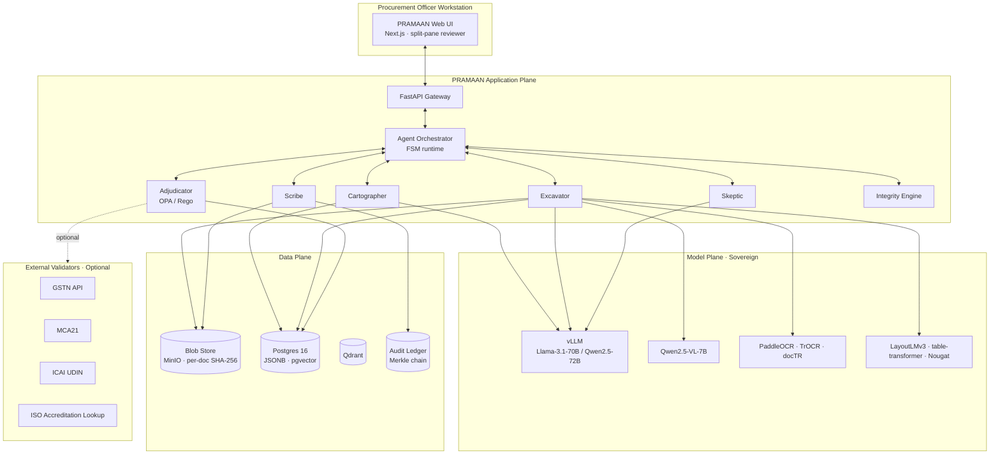
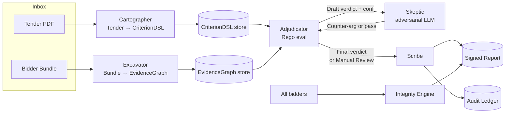
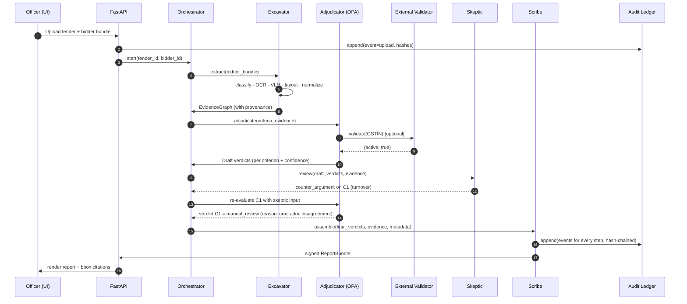
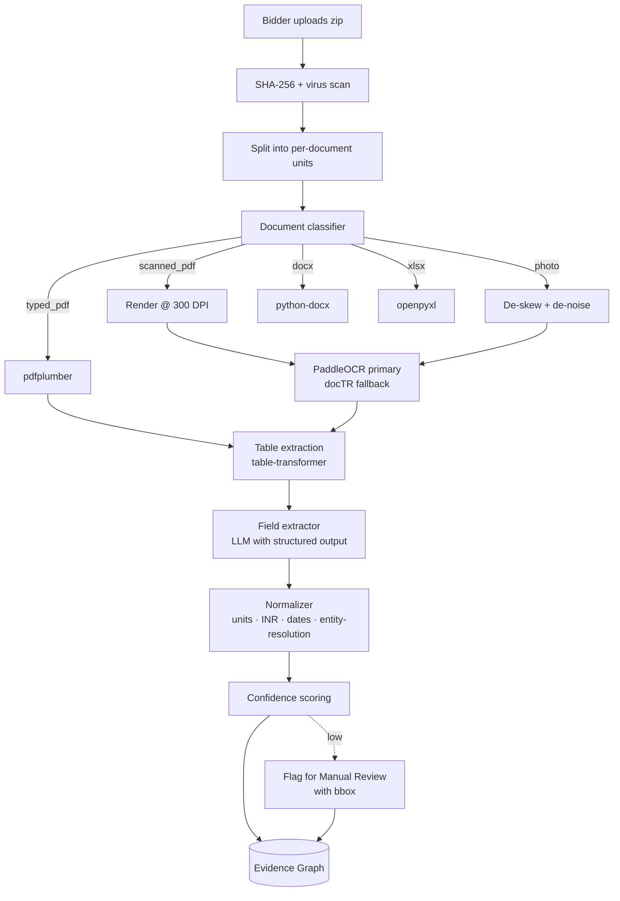
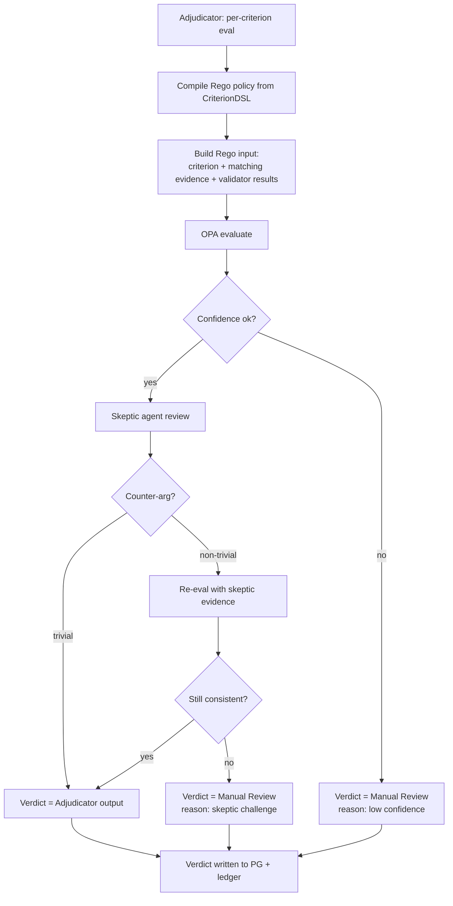

# Architecture Deep Dive

This document is the engineering blueprint for PRAMAAN. It assumes you have read [`01-solution.md`](01-solution.md). Where the master document explains *what* and *why*, this one explains *how* — components, contracts, data shapes, and failure modes.

---

## 1. System context



The dotted line to external validators denotes that they are *optional*; the system runs fully air-gapped without them, with those validators returning `inconclusive`, which routes the criterion to Manual Review.

---

## 2. The agent topology

PRAMAAN uses five agents with deliberately narrow contracts. They never share mutable state. They communicate only through typed messages on a queue, and every message is persisted to the audit ledger.



### 2.1 Agent contracts

| Agent | Input | Output | Implementation |
|---|---|---|---|
| **Cartographer** | tender PDF (+ pages) | `CriterionDSL` (typed YAML/JSON) | LLM with Outlines-enforced schema |
| **Excavator** | bidder bundle (N docs) | `EvidenceGraph` (typed nodes with provenance) | OCR → VLM → Layout → LLM normalizer |
| **Adjudicator** | `CriterionDSL` + `EvidenceGraph` | per-criterion `Verdict` + confidence | Pure OPA / Rego — no LLM |
| **Skeptic** | draft `Verdict` + relevant evidence | `accept` or `counter_argument` | LLM, adversarial prompt |
| **Scribe** | final verdicts + evidence + metadata | signed `ReportBundle` + ledger events | Deterministic Python |
| **Integrity Engine** | all bidders' EvidenceGraphs | `IntegrityFlags` per bidder pair | Graph + heuristics, no LLM |

### 2.2 Why a custom FSM and not LangGraph

We considered LangGraph and rejected it. Reasons:

- The orchestration logic must be **trivially auditable** — for an external auditor reading the code, the state machine should be a single Python file with explicit transitions, not a graph hidden behind decorators.
- LangGraph's checkpointer is convenient but introduces a state representation that is hard to reproduce byte-for-byte across versions.
- We need to **persist every transition** to the audit ledger, with a hash-chained event. Doing this through a thin custom FSM is straightforward; doing it through LangGraph's hooks is fragile.
- Latency: the agent graph here is small (~5 nodes). The cost of LangGraph's abstractions is not justified.

---

## 3. End-to-end sequence (one bidder)



Every arrow that crosses a process boundary writes an event to the ledger. The ledger therefore contains a *complete, replayable trace* of every evaluation.

---

## 4. Data plane

### 4.1 Postgres schema (high level)

```sql
-- 1) Tenders, bidders, documents
CREATE TABLE tender (
  id UUID PRIMARY KEY,
  filename TEXT NOT NULL,
  sha256 BYTEA NOT NULL UNIQUE,
  uploaded_by UUID NOT NULL REFERENCES officer(id),
  uploaded_at TIMESTAMPTZ NOT NULL DEFAULT now()
);

CREATE TABLE bidder (
  id UUID PRIMARY KEY,
  tender_id UUID NOT NULL REFERENCES tender(id),
  legal_name TEXT,
  cin TEXT,
  gstin TEXT
);

CREATE TABLE document (
  id UUID PRIMARY KEY,
  bidder_id UUID NOT NULL REFERENCES bidder(id),
  filename TEXT NOT NULL,
  mime TEXT NOT NULL,
  sha256 BYTEA NOT NULL,
  storage_uri TEXT NOT NULL,    -- MinIO key
  page_count INT,
  classification TEXT            -- typed_pdf | scanned_pdf | photo | docx | xlsx | ...
);

-- 2) The DSL and the evidence graph (JSONB so the schema can evolve)
CREATE TABLE criterion_dsl (
  tender_id UUID PRIMARY KEY REFERENCES tender(id),
  dsl JSONB NOT NULL,
  source_model TEXT NOT NULL,
  source_prompt_hash TEXT NOT NULL,
  cartographer_run_id UUID NOT NULL,
  reviewed_by UUID,             -- officer who confirmed
  reviewed_at TIMESTAMPTZ
);

CREATE TABLE evidence_node (
  id UUID PRIMARY KEY,
  bidder_id UUID NOT NULL REFERENCES bidder(id),
  field TEXT NOT NULL,          -- e.g. annual_turnover_inr
  value JSONB NOT NULL,
  unit TEXT,
  fy TEXT,
  document_id UUID NOT NULL REFERENCES document(id),
  page INT NOT NULL,
  bbox JSONB NOT NULL,          -- [x0, y0, x1, y1]
  ocr_conf REAL,
  extractor_conf REAL,
  extractor_model TEXT NOT NULL,
  extractor_prompt_hash TEXT NOT NULL,
  source_text_sha256 BYTEA NOT NULL
);
CREATE INDEX ON evidence_node (bidder_id, field);

-- 3) Verdicts
CREATE TABLE verdict (
  id UUID PRIMARY KEY,
  bidder_id UUID NOT NULL REFERENCES bidder(id),
  criterion_id TEXT NOT NULL,
  status TEXT NOT NULL CHECK (status IN ('eligible','not_eligible','manual_review')),
  confidence REAL NOT NULL,
  reasoning TEXT NOT NULL,
  rego_policy_hash TEXT NOT NULL,
  skeptic_counter JSONB,
  validators JSONB,             -- which external validators were called
  created_at TIMESTAMPTZ NOT NULL DEFAULT now()
);

-- 4) Officer overrides
CREATE TABLE override (
  id UUID PRIMARY KEY,
  verdict_id UUID NOT NULL REFERENCES verdict(id),
  officer_id UUID NOT NULL REFERENCES officer(id),
  new_status TEXT NOT NULL,
  reason TEXT NOT NULL,
  reason_tag TEXT NOT NULL,
  created_at TIMESTAMPTZ NOT NULL DEFAULT now()
);

-- 5) The audit ledger
CREATE TABLE ledger_event (
  seq BIGSERIAL PRIMARY KEY,
  ts TIMESTAMPTZ NOT NULL DEFAULT now(),
  actor TEXT NOT NULL,          -- 'cartographer' | 'officer:abc' | ...
  kind TEXT NOT NULL,
  payload JSONB NOT NULL,
  prev_hash BYTEA,
  hash BYTEA NOT NULL
);
CREATE UNIQUE INDEX ON ledger_event (hash);
```

Notes:

- We store `value` as `JSONB` so the same column can hold scalars, arrays (e.g. project lists), and nested structures.
- `evidence_node` is a *node* in the graph; relationships (e.g. "this CA certificate attests this turnover figure") are stored separately if needed; for the MVP a flat node table with `field` is sufficient.
- The audit ledger is append-only at the application level; in production we additionally use Postgres row-level constraints and revoke `UPDATE`/`DELETE` from the application role.

### 4.2 Blob store

MinIO (S3-compatible) holds the original documents and rendered page images. Every object key includes the SHA-256 to make tampering detectable at retrieval time.

### 4.3 Vector store

Qdrant holds embeddings of:

- past tender criteria (so a new tender can suggest "we have seen this kind of criterion 14 times before")
- bidder project descriptions (for the C2-style "similar project" check, since "similarity" needs a semantic notion)

Both collections are payload-indexed by tenant + tender_id for hard isolation.

---

## 5. Data flow — bidder ingestion



Highlights:

- **Single source of truth for confidence.** Every node carries OCR confidence (from the OCR engine) and extractor confidence (from the LLM's logprobs / self-rated score). Final node confidence = `min(ocr_conf, extractor_conf)`. We deliberately use `min` to avoid optimistic bias.
- **Cross-document agreement.** When the same field is extracted from multiple documents (e.g. turnover from both audited FS and CA certificate), we compute an agreement score. Disagreement raises confidence on the consistent value, lowers it on the outlier, and may raise a Manual Review flag.
- **Entity resolution.** Bidder names appear with variations ("ABC Constructions Pvt. Ltd.", "ABC Constr (P) Ltd"). We canonicalize using CIN as the primary key, with a fallback fuzzy-matcher.

---

## 6. Adjudication flow



The Skeptic loop runs at most twice. After two iterations without convergence, the verdict is automatically downgraded to Manual Review. This bounds latency and prevents infinite adversarial loops.

---

## 7. Service decomposition

| Service | Responsibility | Language | Replicas |
|---|---|---|---|
| `pramaan-api` | HTTP gateway, auth, file uploads | Python (FastAPI) | 2+ |
| `pramaan-orchestrator` | FSM agent runtime, queue consumer | Python | 2+ |
| `pramaan-extractor` | OCR + VLM + Layout + LLM extraction workers | Python (Ray Serve) | N (GPU) |
| `pramaan-adjudicator` | OPA sidecar + thin wrapper | Go (OPA) + Python | 2+ |
| `pramaan-validators` | External validator HTTP clients (GST, UDIN, MCA) | Python | 2+ |
| `pramaan-scribe` | Report assembly, signing, ledger writer | Python | 2+ |
| `pramaan-integrity` | Cross-bidder analytics | Python | 1+ |
| `pramaan-ui` | Next.js frontend | TypeScript | 2+ |
| `vllm-extractor` | LLM serving (large) | vLLM | 1+ (GPU) |
| `vllm-vlm` | VLM serving | vLLM | 1+ (GPU) |
| `postgres` | Primary data + ledger | Postgres 16 | 1 (HA in prod) |
| `qdrant` | Embeddings | Qdrant | 1 |
| `minio` | Blob store | MinIO | 1 (HA in prod) |
| `langfuse` | LLM observability | Langfuse | 1 |
| `redis` | Queue + cache | Redis | 1 |

---

## 8. Cross-cutting concerns

### 8.1 Determinism and reproducibility

- All LLM calls use `temperature=0` and a fixed `seed` where the engine supports it.
- Model artifacts are pinned by SHA-256 in a local registry (Harbor / Docker Distribution).
- Prompts are versioned: each prompt template gets a hash that is included in every event.
- Rego policies are version-controlled; the policy hash is included in every verdict.
- Tests in CI execute "golden bundles": a fixed input must produce a known-good output bundle. CI fails on byte-difference.

### 8.2 Security

- All inter-service traffic is mTLS in production (via service mesh or sidecar).
- Document uploads are virus-scanned (ClamAV) and content-type-sniffed.
- The signing key is held in an HSM (SoftHSM in dev, YubiHSM/CloudHSM-equivalent in prod). The API service has no direct key access; only the Scribe service does, and only via a signing endpoint.
- Auth is OIDC, designed to plug into NIC SSO / e-Pramaan. Officers have RBAC roles: `viewer`, `evaluator`, `signer`.
- Tender data and bidder data are tenant-isolated at the row level (Postgres RLS).
- Audit-ledger writes are append-only at the DB privilege level.

### 8.3 Observability

- OpenTelemetry traces every request end-to-end across services.
- Langfuse captures every LLM call with full prompt/response and per-call cost/latency.
- Grafana dashboards: per-tender latency, per-stage error rates, abstention rate, validator success rate, model GPU utilization.
- A `Reproducibility` dashboard shows the rolling rate of "re-running golden bundles produced byte-identical output" — this should always be 100%.

### 8.4 Failure modes and graceful degradation

| Component down | Behavior |
|---|---|
| External validator unreachable | Verdict for that criterion → Manual Review with reason `validator_inconclusive` |
| VLM down | Photo documents → Manual Review with reason `vlm_unavailable` |
| LLM extractor down | Hard fail; no silent partial results |
| OPA down | Hard fail; no silent partial results |
| Audit ledger DB down | API rejects new evaluations; existing evaluations cannot be finalized; this is intentional — no decision without an audit trail |

---

## 9. Why this architecture and not a simpler one

The simpler architecture is: tender PDF → embeddings → vector DB; bidder PDF → embeddings → vector DB; LLM prompt: "is this bidder eligible for this tender?" That works for a demo. It fails for CRPF.

The PRAMAAN architecture costs more to build, but it earns five things the simpler architecture cannot:

1. **A typed, inspectable representation of the rules** (CriterionDSL) — the officer can read, edit, and version-control them.
2. **A deterministic verdict path** (OPA) — no hallucinations in the decision.
3. **Pixel-grounded evidence** — every report cell is one click from its source pixels.
4. **Adversarial verification** (Skeptic) — disagreement is engineered into the loop.
5. **A cryptographic audit trail** — the only one of these that is actually admissible in a procurement appeal.

These are the properties that make the difference between a "cool LLM demo" and "the system CRPF can sign off on."
