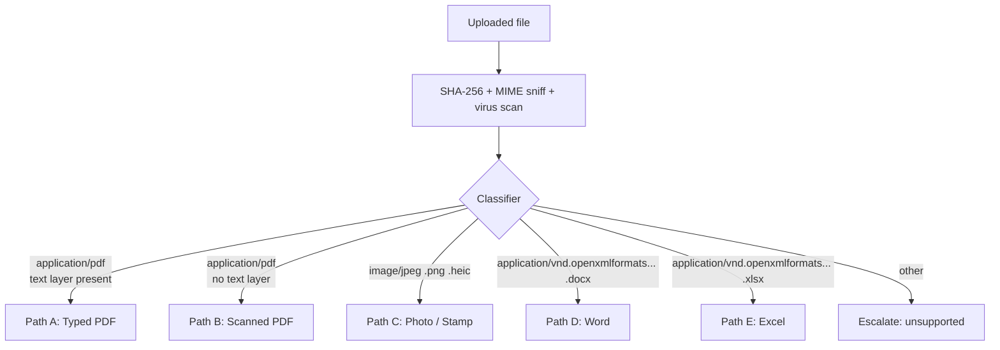

# Document Understanding Pipeline

The brief calls out the hardest realistic case: bidder bundles arrive as a mix of typed PDFs, scanned PDFs, Word, Excel, and **photographs of physical certificates**. PRAMAAN must handle them all and produce evidence with full provenance.

This document specifies the pipeline.

---

## 1. The router

The first step is classification. We do not run every modality on every file.



Detection rules:

- **Typed vs scanned PDF**: extract text via `pdfplumber`. If extracted text density across pages is above a threshold *and* `pdf2image` rendering shows text-like glyphs are present, it's typed. Otherwise it's scanned.
- **Photo classification**: EXIF orientation + edge-density + Hough-line detection identifies photographs of paper documents (vs born-digital images).
- **Hybrid PDFs** (typed text + scanned page inside): handled per-page rather than per-document.

---

## 2. Path A — Typed PDF

```
pdfplumber → text spans with bbox → LayoutLMv3 (block role classification)
          → table-transformer (table extraction with cells)
          → field extractor (LLM with structured output)
```

Preserves exact bboxes from the PDF. OCR confidence does not apply (no OCR was run); set `ocr_conf = 1.0` and rely on `extractor_conf`.

---

## 3. Path B — Scanned PDF

```
pdf2image render @ 300 DPI → de-skew → de-noise → adaptive thresholding
                          → PaddleOCR (primary) → docTR (fallback if PaddleOCR conf < 0.7 on a region)
                          → Tesseract (last resort)
                          → LayoutLMv3 + table-transformer for structure
                          → field extractor
```

Why this stack:

- **PaddleOCR** has the strongest open-weights support for Indian scripts (Devanagari, Tamil, Bengali, etc.) — common in regional certificates.
- **docTR** has the best plain-English accuracy and provides word-level confidence.
- **Tesseract** is the universal fallback.

Per-character confidence is preserved through the pipeline. Each output token carries `(char, bbox, conf)`.

---

## 4. Path C — Photographs and stamps

Photographs of physical certificates are the worst-case input: skewed, glare, partial, angle, sometimes a stamp obscuring a number.

```
EXIF rotate → perspective rectification (4-corner detect via DocAligner)
            → glare removal → super-resolution (Real-ESRGAN) if low DPI
            → Qwen2.5-VL-7B (Vision-Language Model)
            → fallback to Path B if VLM confidence < 0.6
```

Why a VLM and not just OCR:

- Stamps and seals contain semi-structured text in a circular layout — OCR fails here, VLMs handle it.
- Handwritten endorsements ("certified true copy") on stamped pages are best read by a VLM that understands the visual context.
- Photos at angles with partial occlusion benefit from the VLM's ability to *infer* missing characters from context (with a confidence penalty).

The VLM is asked structured questions: *"Extract the following fields from this image as JSON: { issuer, issued_to, date, certificate_number, validity_to }. If a field is unreadable, set it to null and lower confidence."*

---

## 5. Path D — Word

```
python-docx → text + tables + embedded images
            → embedded images recursively go to Path C
            → field extractor on combined text
```

Word docs are easy on text and hard on embedded images. We treat embedded images as separate documents that re-enter the router.

---

## 6. Path E — Excel

```
openpyxl → cell-level data with merged-cell handling
        → table-aware extractor (column-header detection)
        → field extractor
```

Excel is great for financials when bidders submit them as such. Merged cells and split headers are common pitfalls; we run a header-detection pass before extraction.

---

## 7. Layout: tables and complex pages

A turnover figure is almost always inside a table. Two engines:

- **table-transformer** (Microsoft) — strong on bordered tables.
- **Nougat** (Meta) — strong on academic / dense layouts; excellent for complex tender BoQs.

We run both on candidate pages, score the cell graphs, and pick the higher-confidence parse. The chosen output is what feeds the field extractor.

---

## 8. The field extractor

After bytes become text + bboxes + table cells, the **field extractor** is a small LLM call (per document, structured output) that maps the raw content to typed evidence nodes:

```python
@instructor.patch(client)
class TurnoverNode(BaseModel):
    annual_turnover_inr: int
    fy: str = Field(pattern=r"^\d{4}-\d{2}$")
    auditor_name: Optional[str]
    ca_membership_no: Optional[str]
    extractor_confidence: float
    source_quote: str         # exact substring from OCR text
```

The extractor is **forced to quote** — `source_quote` must be a substring of the OCR'd text on the page. We re-locate that substring back to a bbox via fuzzy alignment. This guarantees that every value the LLM extracts is grounded in actual text we can show the officer.

If the LLM emits a value but `source_quote` cannot be matched to the OCR text within tolerance, the extraction is rejected and routed to Manual Review with reason `value_not_grounded`.

This is the central trick that prevents the LLM from inventing numbers.

---

## 9. Normalization

Bidders write the same value in many ways:

- "₹5,00,00,000" / "Rs. 5 Crore" / "INR 50000000" / "5.0 Cr" / "Five crore"
- "FY 23-24" / "FY 2023-24" / "AY 2024-25" / "2023-2024"

The normalizer applies:

- **Indian-numbering parser** (lakhs/crores) with regex + LLM fallback for prose
- **Date normalizer** to ISO-8601 with FY/AY disambiguation
- **Entity canonicalizer** for company names (CIN as primary key, fuzzy fallback)
- **Unit canonicalizer** to SI / INR

Output is a typed `EvidenceNode` ready for the Evidence Graph.

---

## 10. Confidence

Every node carries:

- `ocr_conf` — character-level minimum across the source span
- `extractor_conf` — extractor's self-rated confidence (instructor's logprob aggregate or self-eval prompt)
- `provenance_match_conf` — how well `source_quote` aligned to OCR text (Levenshtein-based)
- `final_conf = min(ocr_conf, extractor_conf, provenance_match_conf)`

We use **min** to be deliberately conservative. A node is only as confident as its weakest link.

---

## 11. Cross-document agreement

The same field often appears in multiple documents. We aggregate:

```
nodes_for(field, bidder) = [N1, N2, ...]
agreement_score = 1 - normalized_variance(values) if numeric
                = jaccard_overlap(tokens) if textual
```

If `agreement_score < 0.9` and at least two nodes are present, we raise `cross_doc_disagreement` and route to Manual Review. The officer sees both values and both source bboxes side-by-side.

This single check catches many real-world edge cases: a turnover that's ₹5.12 cr in the audited FS but ₹5.02 cr in the CA certificate; a project completion date that differs by a month between the work order and the completion certificate.

---

## 12. Failure modes and what we do about them

| Failure | Detection | Response |
|---|---|---|
| Page too low DPI (< 150) | DPI computed from rendered image | Auto super-res; warn officer; lower confidence |
| Extreme skew (> 5°) | Hough-line angle | Auto-rectify; if still skewed, warn |
| OCR confidence < 0.6 across the whole page | Mean conf | Try docTR / Tesseract; if all fail, mark page un-readable; bidder is *not* disqualified — affected criteria go to Manual Review |
| Table-transformer disagrees with Nougat | Cell-graph diff | Take higher confidence; flag if both low |
| Encrypted/password-protected PDF | PDF parse failure | Reject upload with clear officer-facing error; ask for unprotected version |
| File is a video or audio | MIME sniff | Reject with clear error |

---

## 13. Performance and cost notes

- Document classification + OCR is parallel per page on a worker pool.
- VLM calls are batched.
- Field extractor calls are cached on `(doc_sha256, prompt_hash, model_version)` so re-runs on the same document are free.
- A 100-page bidder bundle of mixed types should process end-to-end in under 3 minutes on a single A100, under 10 minutes on a single L4.

---

## 14. Why this is better than "throw it all at GPT-4V"

Tempting alternative: dump every page image into a multimodal LLM and ask for a structured JSON. We rejected it. Reasons:

- **Provenance.** GPT-4V will not give you reliable bboxes. PRAMAAN needs them.
- **Sovereignty.** GPT-4V is hosted; CRPF cannot use it for production.
- **Cost.** A 200-page bundle costs more than the value it produces.
- **Confidence calibration.** A black-box VLM gives you no way to compute `min(ocr_conf, extractor_conf)`.
- **Reproducibility.** GPT-4V is a moving target.

The pipeline above is the cost of doing this responsibly.
