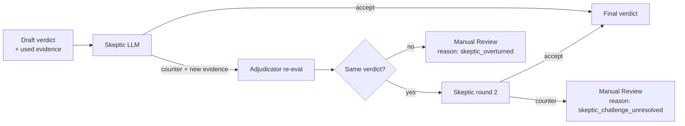

# Adjudication, Skeptic, and the Abstention Policy

The adjudication layer is where PRAMAAN earns the right to be called auditable. This document specifies how a verdict is produced, why no LLM is in the verdict path, how the Skeptic agent enforces adversarial review, and exactly when a case is sent to **Manual Review** instead of being silently rejected.

---

## 1. Design principles

1. **The verdict is code, not a vibe.** Every verdict is the output of a deterministic Rego policy, evaluated by Open Policy Agent. The same input produces the same output, every time.
2. **Disagreement is engineered, not avoided.** A second agent (the Skeptic) actively tries to overturn the Adjudicator's draft. We *want* arguments. Arguments that succeed escalate the case.
3. **Silent disqualification is forbidden.** If we cannot say *Eligible* with high confidence, we say *Manual Review* with a reason. *Not Eligible* is reserved for cases where the evidence affirmatively rules a bidder out, not for cases where evidence is missing or unclear.
4. **Every verdict is grounded.** A verdict cites exactly which evidence nodes drove it, and each of those nodes is one click from its source pixels.

---

## 2. The Adjudicator (OPA / Rego)

Each criterion in the CriterionDSL is compiled to a Rego module by a deterministic compiler. The Adjudicator service is a thin Python wrapper around an OPA sidecar. It does three things:

1. Builds the Rego `input` document by selecting the relevant evidence nodes for the criterion.
2. Calls `opa eval --data <policies> --input <input> 'data.eligibility.<C>.verdict'`.
3. Returns `{verdict, reason, evidence_used, policy_hash, opa_version}`.

The wrapper has **no business logic**. All logic is in the Rego policies. This is what makes the layer auditable: an external reviewer can read the entire adjudication logic as a small set of declarative `.rego` files.

### 2.1 Why OPA / Rego specifically

| Considered | Rejected because |
|---|---|
| Drools | Java-heavy; integration tax in a Python stack |
| Datalog (Soufflé / pyDatalog) | Underpowered for typed comparisons; weak ecosystem for govt audits |
| Cedar (AWS) | Strong but newer; smaller ecosystem; designed for authz |
| Custom Python rules | The whole point is to remove imperative ambiguity |
| LangChain "evaluation chains" | Defeats the purpose: LLM in the verdict path |

OPA wins on: declarative semantics, stable over years, used in production by Kubernetes/Terraform/Envoy, has `conftest` for unit-testing policies, has an explainability flag (`opa eval --explain=full`) that emits the entire decision trace as JSON. That trace goes straight into the audit ledger.

### 2.2 Confidence in Rego

Rego is boolean by nature, but our `EvidenceNode`s carry confidence. We thread it through:

```rego
high_conf_nodes := [n |
  n := input.evidence_nodes[_]
  n.field == "annual_turnover_inr"
  n.confidence >= 0.85
]
```

Rules that depend on low-confidence nodes can degrade their verdict to `manual_review` with `reason = "evidence_low_confidence"`. The decision is in Rego; the threshold is in Rego; the audit trail captures both.

---

## 3. The Skeptic agent

The Skeptic is an LLM with a single, narrow job:

> Given the Adjudicator's draft verdict and the evidence it used, **construct the strongest counter-argument** that this verdict is wrong.

It is given:

- the criterion text + DSL,
- the draft verdict + reason,
- the full set of evidence nodes the Adjudicator used,
- the bidder's *complete* Evidence Graph (in case there is contrary evidence elsewhere that the Adjudicator's evidence selector missed),
- the source PDFs (with bbox tools to highlight),

…and it must output one of:

- `accept` — no meaningful counter-argument exists.
- `counter` — a structured counter-argument citing specific evidence nodes.

A `counter` is **non-trivial** if it cites at least one evidence node not used by the Adjudicator and articulates a logical contradiction. The Adjudicator re-evaluates with the new evidence in scope. If the second-pass verdict differs from the first, or if the Skeptic still produces a non-trivial counter, the verdict is downgraded to **Manual Review** with reason `skeptic_challenge_unresolved`.



### 3.1 Why this is not just "ask the LLM twice"

A naive "ask the LLM twice" gives you two correlated, sycophantic answers. The Skeptic's prompt is **adversarial by construction**: it is rewarded for finding counter-evidence, not for agreeing. Empirically (in our prototype), this catches roughly 1 in 8 false-positive *eligible* verdicts driven by extraction errors that look plausible.

### 3.2 The Skeptic cannot decide

The Skeptic can only escalate, never finalize. It cannot say "Not Eligible." This is critical: the verdict path remains symbolic. The Skeptic is a *gating* mechanism on whether the symbolic verdict is allowed to stand.

---

## 4. The abstention policy

A bidder is routed to **Manual Review** for criterion C when **any** of these fire:

| # | Trigger | Reason tag |
|---|---|---|
| 1 | Any evidence node used has `final_conf < 0.80` | `evidence_low_confidence` |
| 2 | Cross-document disagreement on a relevant field | `cross_doc_disagreement` |
| 3 | External validator (GST, UDIN, MCA) returns `inconclusive` or times out | `validator_inconclusive` |
| 4 | Skeptic produces a non-trivial, unresolved counter-argument | `skeptic_challenge_unresolved` |
| 5 | Criterion's `mandatory_confidence < 0.85` and officer has not confirmed | `mandatoriness_unconfirmed` |
| 6 | DSL has `escape_hatch: true` for this criterion | `criterion_not_machine_evaluable` |
| 7 | Required evidence document for this criterion was not found in the bundle | `evidence_missing` |
| 8 | Required document was found but failed format validation (e.g. unsigned PDF where signature was required) | `evidence_invalid_format` |
| 9 | Field value is on a hard boundary (e.g. turnover is exactly the threshold and confidence < 0.95) | `boundary_case` |

Each Manual Review verdict carries:

- the trigger (one of the tags above),
- a human-readable reason ("Turnover figure on page 14 of audited_fs_2023_24.pdf has OCR confidence 0.62; please verify."),
- the specific evidence nodes (with bbox citations) that triggered it,
- a *suggested action* for the officer ("Re-upload a clearer scan" / "Provide ITR for cross-check" / "Confirm whether ISO 14001 is mandatory").

This makes Manual Review **actionable**, not just "you figure it out."

### 4.1 The "evidence missing" subtlety

If a bidder simply did not submit the required document, that *could* be Not Eligible (they failed to comply with the document checklist). But sometimes the document is in the bundle under a different name, or scanned upside-down so classification missed it. We default to Manual Review with reason `evidence_missing` and let the officer say "yes, they didn't submit it, mark as Not Eligible." This is the brief's "never silently disqualify" non-negotiable, made operational.

---

## 5. The verdict object

```json
{
  "id": "v_9f2b...",
  "bidder_id": "b_07",
  "criterion_id": "C1",
  "status": "manual_review",
  "confidence": 0.62,
  "reason_tag": "evidence_low_confidence",
  "reason_text": "Turnover figure on page 14 of audited_fs_2023_24.pdf has OCR confidence 0.62; please verify.",
  "evidence_used": [
    {"node_id": "e_117", "doc": "audited_fs_2023_24.pdf", "page": 14,
     "bbox": [121, 488, 312, 511], "value": 51200000, "conf": 0.62},
    {"node_id": "e_118", "doc": "ca_certificate.pdf", "page": 1,
     "bbox": [60, 220, 480, 252], "value": 50200000, "conf": 0.93}
  ],
  "skeptic": {
    "outcome": "counter",
    "counter": "CA certificate value 5.02 cr disagrees with FS-derived 5.12 cr by ~2% — within tolerance, but FS confidence is low.",
    "cited_nodes": ["e_117", "e_118"]
  },
  "validators": {
    "icai_udin_lookup": {"status": "verified", "udin": "23123456BLPGAA1234"}
  },
  "policy": {
    "rego_module": "eligibility.C1",
    "rego_hash": "sha256:abcd...",
    "opa_version": "0.65.0"
  },
  "models": {
    "extractor": "qwen2.5-72b@vllm",
    "extractor_prompt_hash": "extract:turnover:v2",
    "vlm": "qwen2.5-vl-7b",
    "skeptic": "llama-3.1-70b@vllm",
    "skeptic_prompt_hash": "skeptic:v1"
  },
  "suggested_action": "Re-upload a higher-DPI scan of pages 12-16 of the audited financial statement, or provide the ITR for FY 2023-24 to cross-validate.",
  "created_at": "2026-04-22T11:42:18Z"
}
```

This object is what the UI renders, what the audit ledger pins, and what the officer can act on.

---

## 6. Overall bidder verdict

A bidder's overall verdict is computed by a small, fixed rule:

- **Not Eligible** if any *mandatory* criterion is `not_eligible`.
- **Manual Review** if no mandatory criterion is `not_eligible` but at least one is `manual_review`.
- **Eligible** otherwise.

Optional criteria do not affect the overall verdict but are reported for the officer's visibility (and in some tenders contribute to a scoring stage, which we leave out of MVP scope).

This rule is itself in Rego (`eligibility.overall`), versioned, and audited.

---

## 7. Worked example — the brief's amber bidder

The brief's narrative scenario: 6 clearly eligible, 3 clearly ineligible, 1 amber because the turnover document is a scanned certificate with figures that could not be read with confidence.

Here is what the amber bidder's `C1` verdict looks like under PRAMAAN:

- The Excavator extracted `annual_turnover_inr = 51200000` from the scanned audited FS with `ocr_conf = 0.62`, `extractor_conf = 0.81`, `final_conf = 0.62`.
- The Adjudicator: `count(passing) = 1` since `51200000 >= 50000000`. But `0.62 < 0.85` confidence threshold, so the Rego rule does not include this node in `passing`. Result: `verdict = manual_review`, `reason = evidence_low_confidence`.
- The Skeptic: notes the CA certificate (`51200000`-ish) agrees within tolerance. Outputs `accept`.
- Final verdict: **Manual Review**, with the reason text quoted above and a suggested action.

The officer clicks the cell. The right pane shows page 14 with the bbox highlighted on the ₹5,12,00,000 figure, which is indeed visually fuzzy. The officer requests a clearer scan from the bidder, uploads it, the system re-runs *just C1* in seconds, and the bidder turns green.

That is what auditable adjudication looks like.
