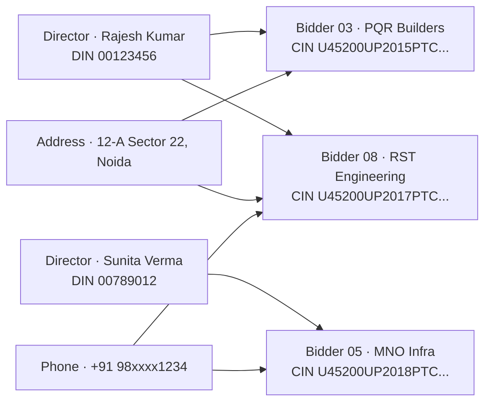

# The Integrity Layer (Bonus)

The brief asks for eligibility evaluation. PRAMAAN goes one step further and asks: **did the set of bidders behave honestly?** This is a parallel analytics pass over the entire bidder pool that surfaces cartel behaviour, capacity inconsistencies, and forgery signals.

This is the differentiator that no generic LLM-wrapper submission will have. CRPF will recognise it as the part that addresses the realities they actually face.

---

## 1. Why this matters for CRPF

Government procurement attracts coordinated bidding. The classic patterns are well-documented in CVC reports:

- **Bid rotation.** A small group of "competitors" take turns winning, with the others bidding artificially high to lose.
- **Cover bidding.** Shell companies controlled by the same beneficial owners place "competitive" bids alongside the real bid.
- **Capacity inflation.** A tiny company claims execution of multiple large concurrent projects to clear a turnover/experience criterion.
- **Forged credentials.** Fabricated ISO certificates, lapsed GST passed off as active, expired licences.

A pure eligibility checker can clear all bidders as "Eligible" and still hand the contract to a cartel. The Integrity Layer surfaces these patterns to the officer.

The Integrity Layer **never auto-disqualifies**. It surfaces signals; the officer decides.

---

## 2. Signal categories

### 2.1 Cartel / collusion signals

Cross-bidder graph analytics over normalized entity attributes.

| Signal | How we detect |
|---|---|
| Shared director (DIN) | Cross-reference all bidders' CINs against MCA21; build a director graph |
| Shared registered address | Geocode addresses; flag matches at building / unit level |
| Shared phone numbers in submitted contact info | Direct match across documents |
| Shared bank accounts | If account numbers are submitted (e.g. for EMD refund), match across bidders |
| Near-duplicate document hashes | SimHash on document text content; flag pairs with similarity > 0.92 across "different" bidders |
| Suspiciously similar bid prices | Statistical: variance of bid prices is below a threshold; or bid prices form an arithmetic progression |
| Shared upload metadata | Submission IP, browser fingerprint, PDF creator software, EXIF camera serial — when available |
| Common email domain among 'unrelated' bidders | Lightweight signal; combined with others |

These are surfaced as a **Linkage Graph** the officer can explore visually.

### 2.2 Capacity-vs-claim signals

A bidder claiming to execute multiple ₹50 cr projects but with the EPFO contribution of an 8-employee firm is mathematically suspect.

| Signal | How we detect |
|---|---|
| Project-portfolio vs employee count mismatch | EPFO/ESIC employee counts cross-checked against claimed project values per Crocodile-style ratio (revenue per employee) |
| Project portfolio overlapping in time | Build a Gantt of claimed projects; flag overlaps that exceed plausible execution capacity |
| Net worth vs project value mismatch | Claimed solvency for ₹X but balance-sheet net worth is much lower |
| Equipment list vs claimed throughput | Where applicable (construction tenders) |

### 2.3 Forgery signals

Per-document analysis for tampering and fabrication.

| Signal | How we detect |
|---|---|
| Font inconsistency in scanned certificates | Font-fingerprinting on rendered glyphs across regions of the same document |
| EXIF / metadata anomalies | PDF creator software, modification timestamps, camera EXIF on certificate photos |
| Compression artifacts inconsistent with claimed origin | If a "scan" has JPEG-of-a-PDF artifacts, suspect retouching |
| Signature mismatch | Where signature samples are available, compare strokes |
| Certificate number absent from issuer registry | ICAI UDIN, ISO accreditation body, IAF, MCA21, GSTN — direct lookups |
| Date inconsistency | Issued date after claimed validity, or before issuer existed |
| Logo/watermark drift | OCR errors and pixel-level diffs against canonical issuer logos |

### 2.4 Statistical and behavioural signals

| Signal | How we detect |
|---|---|
| Anomalously fast submission | Submission immediately after tender publication is unusual for complex tenders |
| Bid round-number clustering | Many bids at suspiciously round figures may indicate cover bidding |
| First-time bidders with unusually high credentials | Newly incorporated entities (per CIN issue date) claiming long experience histories |

---

## 3. The output: the Integrity Panel

Findings appear as a separate panel in the officer UX (see `07-officer-ux.md`). Each finding has:

- A **severity** (Info / Warning / Critical)
- A **category** (Cartel / Capacity / Forgery / Statistical)
- A **claim** in plain English
- An **evidence list** with click-through bbox citations
- A **suggested action** ("Verify with EPFO portal", "Request explanation from bidder", "Refer to vigilance")

Critical findings auto-set the affected bidder's overall status to **Manual Review**. Warning and Info findings do not change verdicts.

---

## 4. The linkage graph

A small interactive graph visualization (D3 / vis-network) showing entities (bidders, directors, addresses, phones, banks) and edges (shares, controls, lives-at). Clicking a node shows the underlying evidence. The officer can see at a glance whether three "unrelated" bidders cluster around a single director.

In the example above, B3 and B8 share both a director and a registered address, and B8 and B5 share a phone number. The officer is shown this graph with the supporting evidence one click away.

---

## 5. Implementation notes

- Built as a separate `pramaan-integrity` service; runs after all bidders' Excavator runs are complete.
- Reads from the Evidence Graph and from external registries (where allowed).
- Produces `IntegrityFlag` records persisted in Postgres and written to the audit ledger.
- Does **not** mutate verdicts directly; raises `mark_for_review` events for the Adjudicator if a Critical finding lands.
- Heuristic thresholds are configurable per organization and recorded in the bundle metadata.

---

## 6. Honest caveats

- The Integrity Layer's signals are heuristics. They are not legal proof. The system communicates this clearly: "Two bidders share a director; this may indicate common ownership."
- False positives are possible (e.g. legitimate group companies bidding under transparent disclosure). Officer judgment is the final filter.
- Some signals require external data (MCA21, EPFO) that may be unavailable in air-gapped deployments. In that case the corresponding signals are skipped with a logged note.

---

## 7. Why this layer is the "wow" in the demo

Stand the demo up. Show ten bidders. Show six green, three red, one amber. The Integrity Panel lights up: "Bidder 3 and Bidder 8 share a director and address; their bid prices differ by 1.2%."

That is the moment a CRPF judge stops thinking "AI tool" and starts thinking "this is what the vigilance cell needs."
